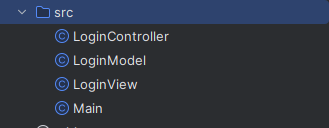
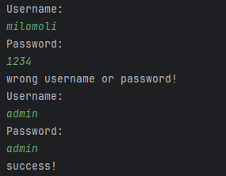

- [\[JAVA\] - BUỔI 11: CÁC NGUYÊN TẮC THIẾT KẾ, MÔ HÌNH THIẾT KẾ](#java---buổi-11-các-nguyên-tắc-thiết-kế-mô-hình-thiết-kế)
  - [SOLID là gì?](#solid-là-gì)
    - [Single responsibility priciple](#single-responsibility-priciple)
    - [Open/Closed principle](#openclosed-principle)
    - [Liskov substitution principle](#liskov-substitution-principle)
  - [KISS, DRY, YAGNI](#kiss-dry-yagni)
    - [KISS](#kiss)
    - [YAGNI](#yagni)
    - [DRY](#dry)
  - [Mô hình MVC](#mô-hình-mvc)
    - [Định nghĩa MVC và các thành phần của nó](#định-nghĩa-mvc-và-các-thành-phần-của-nó)
    - [Luồng xử lý trong MVC](#luồng-xử-lý-trong-mvc)
    - [Tại sao nên sử dụng mô hình MVC trong lập trình](#tại-sao-nên-sử-dụng-mô-hình-mvc-trong-lập-trình)
    - [Tạo 1 mô hình MVC](#tạo-1-mô-hình-mvc)

# [JAVA] - BUỔI 11: CÁC NGUYÊN TẮC THIẾT KẾ, MÔ HÌNH THIẾT KẾ
## SOLID là gì?
SOLID là viết tắt của 5 chữ cái đầu trong 5 nguyên tắc thiết kế hướng đối tượng, giúp cho developer viết ra những đoạn code dễ đọc, dễ hiểu, dễ maintain, được đưa ra bởi Bob Martin và Michael Feathers. Việc theo sát 5 nguyên tắc này nói thì để đáp ứng cả 5 nguyên tắc e là điều không đơn giản. 5 nguyên tắc đó bao gồm:

* **S**ingle responsibility priciple (SRP)
* **O**pen/Closed principle (OCP)
* **L**iskov substitution principe (LSP)
* **I**nterface segregation principle (ISP)
* **D**ependency inversion principle (DIP)
### Single responsibility priciple
Nguyên lý đầu tiên ứng với chữ `S` trong `SOLID`, có ý nghĩa là **một class chỉ nên giữ một trách nhiệm duy nhất**. Một class có quá nhiều chức năng sẽ trở nên cồng kềnh và trở nên khó đọc, khó maintain.

Nguyên lý SRP cho phép chúng ta chia nhỏ và phân tách các thành phần trong phần mềm thành các đơn vị độc lập, mỗi đơn vị chỉ chịu trách nhiệm cho một nhiệm vụ cụ thể. Điều này giúp cho mã nguồn trở nên dễ đọc và hiểu hơn, dễ bảo trì và mở rộng hơn, đồng thời giảm thiểu sự phức tạp của mã nguồn.

Ví dụ, trong một ứng dụng quản lý bán hàng, chúng ta nên tách riêng phần quản lý đơn hàng và phần quản lý sản phẩm. Nếu đơn hàng và sản phẩm được quản lý trong cùng một class hoặc module, điều này sẽ gây ra sự phức tạp và khó bảo trì khi có sự thay đổi hoặc mở rộng phần mềm.
### Open/Closed principle
Nguyên lý thứ 2 ứng với chữ `O` trong `SOLID`. Nội dung `Có thể thoải mái mở rộng 1 class nhưng không được sửa đổi bên trong class đó (open for extension but closed for modification)`

Nguyên lý này khuyến khích việc thiết kế các hệ thống phần mềm sao cho các đối tượng được bảo vệ khỏi các sửa đổi bên trong, đồng thời cho phép mở rộng chức năng của hệ thống bằng cách thêm các thành phần mới.

Sự tuân thủ nguyên lý OCP giúp cho mã nguồn trở nên dễ dàng bảo trì, mở rộng và tái sử dụng hơn. Bằng cách sử dụng các kỹ thuật và mẫu thiết kế phù hợp, chúng ta có thể tạo ra các hệ thống phần mềm có tính mở rộng cao, giúp cho việc phát triển và bảo trì hệ thống trở nên dễ dàng và hiệu quả hơn.
### Liskov substitution principle
Nguyên tắc thứ 3, ứng với chữ `L` trong `SOLID`. Nội dung nguyên tắc này được phát biểu như sau: `Bất cứ instance nào của class cha cũng có thể được thay thế bởi instance của class con của nó mà không làm thay đổi tính đúng đắn của chương trình`.

Theo nguyên lý LS, một lớp con nên thừa hưởng các thuộc tính và phương thức từ lớp cha, đồng thời cũng cần phải tuân thủ tất cả các quy tắc và hành vi của lớp cha. Nghĩa là, khi một đối tượng được khởi tạo từ lớp con, nó cần có thể thực hiện tất cả các chức năng mà đối tượng từ lớp cha có thể thực hiện một cách như nhau.

Việc áp dụng nguyên lý LS giúp cho các lớp trong chương trình trở nên linh hoạt và dễ dàng mở rộng. Nó giúp đảm bảo tính đúng đắn của chương trình khi có sự thay đổi ở cấp độ lớp con, đồng thời giúp giảm thiểu các lỗi liên quan đến sự không tương thích giữa các lớp.

Việc không tuân thủ nguyên lý LS có thể dẫn đến những lỗi không đáng có và gây ra những vấn đề khó xử lý trong chương trình.
## KISS, DRY, YAGNI
### KISS
**Keep It Simple, Stupid - KISS** là nguyên tắc được được đặt ra bởi Kelly Johnson, với ý nghĩa nhấn mạnh tầm quan trọng của sự đơn giản trong các đoạn code. Đoạn code càng đơn giản thì khả năng để đọc và hiểu được đoạn code đó càng nhanh, càng đơn giản càng dễ dàng để bảo trì cũng như thay đổi trong tương lai, việc này sẽ giúp tiết kiệm thời gian hơn rất nhiều.

Việc giữ cho code được đơn giản nhưng vẫn đáp ứng đầy đủ các nhu cầu nghiệp vụ là một nhiệm vụ đòi hỏi thời gian và công sức để tối giản hoá. Code càng tinh gọn, dễ hiểu thì khả năng áp dụng của nó càng mạnh mẽ.

Những cách để áp dụng KISS:
* Không lạm dụng các design parttern, các thư viện nếu như không cần thiết
* Phân loại nhỏ bài toán lớn ra thành các bài toán nhỏ hơn để xử lý ➔ làm mọi thứ đơn giản hơn
* Đặt tên biến, phương thức một cách rõ ràng, dễ đọc
### YAGNI
**You Aren't Gonna Need It - YAGNI** là nguyên tắc chú trọng đến việc không nên làm phức tạp hóa một yêu cầu bằng các giả định trong tương lai. Hay nói cách khác là đừng giả định và xây dựng các chức năng của một phần mềm trước khi cần dùng tới nó.

Việc giả định các chức năng và code chúng sẽ gây ra rất nhiều sự lãng phí về thời gian, tiền bạc cũng như công sức của team (review code, testing, ...) và đôi khi sẽ không thu lại được gì (Khi chức năng đó trong tương lai không hề cần thiết). Do đó chỉ nên dành thời gian phát triển các chức năng cần thiết ở hiện tại.

**Lưu ý**: Nguyên tắc này không bao gồm phạm vi các nhiệm vụ cần đề code được clean, dễ thay đổi. Phạm vi của nguyên tắc này chỉ nói đến các chức năng nghiệp vụ của phần mềm chừ không phải các yêu cầu kĩ thuật của phần mềm. Một source code của phần mềm vẫn cần phải tuân thủ theo các nguyên tắc thiết kế (Clean code, SOLID) để đảm bảo tính linh hoạt cho phần mềm.

### DRY
**Don't Repeat Yourself - DRY** là một nguyên tắc quen thuộc và cốt lõi trong ngành lập trình. Nguyên tắc được xây dựng bởi Andrew Hunt và David Thomas trong cuốn sách của họ The Pragmatic Programmer, muốn nhấn mạnh đến việc nên tái sử dụng lại code hết mức có thể.

Nguyên tắc này giúp cho các phần của code ít bị lặp lại hơn, dễ dàng và nhanh chóng thay đổi các đoạn code (chỉ cần thay đổi ở một nơi mà không cần phải thay đổi ở nhiều nơi) từ đó giảm thiểu thời gian phát triển phần mềm.

Để áp dụng nguyên tắc này thì bất cứ khi nào có một đoạn mã được sử dụng 2 lần ở những nơi khác nhau thì nên đóng gói lại đoạn mã đó (tạo hàm, tạo class, ...) để sau này có thể gọi đến nó để sử dụng lại.
## Mô hình MVC
### Định nghĩa MVC và các thành phần của nó
**MVC** là viết tắt của cụm từ “**Model-View-Controller**“. Đây là mô hình thiết kế được sử dụng trong kỹ thuật phần mềm. MVC là một **mẫu kiến trúc** phần mềm để tạo lập giao diện người dùng trên máy tính. MVC chia thành ba phần được kết nối với nhau và mỗi thành phần đều có một nhiệm vụ riêng của nó và độc lập với các thành phần khác. Tên gọi 3 thành phần:

* **Model**: Là bộ phận có chức năng lưu trữ toàn bộ dữ liệu của ứng dụng và là cầu nối giữa 2 thành phần bên dưới là View và Controller. Một model là dữ liệu được sử dụng bởi chương trình. Đây có thể là cơ sở dữ liệu, hoặc file XML bình thường hay một đối tượng đơn giản. Chẳng hạn như biểu tượng hay là một nhân vật trong game.
* **View**: Đây là phần giao diện (theme) dành cho người sử dụng. View là phương tiện hiển thị các đối tượng trong một ứng dụng. Chẳng hạn như hiển thị một cửa sổ, nút hay văn bản trong một cửa sổ khác. Nó bao gồm bất cứ thứ gì mà người dùng có thể nhìn thấy được.
* **Controller**: Là bộ phận có nhiệm vụ xử lý các yêu cầu người dùng đưa đến thông qua View. Một controller bao gồm cả Model lẫn View. Nó nhận input và thực hiện các update tương ứng.


Mô hình MVC (MVC pattern) thường được dùng để phát triển giao diện người dùng. Nó cung cấp các thành phần cơ bản để thiết kế một chương trình cho máy tính hoặc điện thoại di động, cũng như là các ứng dụng web.

Ví dụ: một Controller có thể cập nhật một Model bằng cách thay đổi các thuộc tính của nhân vật trong game. Và nó có thể sửa đổi view bằng cách hiển thị nhân vật được cập nhật trong game đó.

### Luồng xử lý trong MVC
Luồng xử lý trong của mô hình MVC có thể hình dung cụ thể và chi tiết qua từng bước dưới đây:

* Khi một yêu cầu của từ máy khách (Client) gửi đến Server. Thì bị Controller trong MVC chặn lại để xem đó là URL request hay sự kiện.
* Sau đó, Controller xử lý input của user rồi giao tiếp với Model trong MVC.
* Model chuẩn bị data và gửi lại cho Controller.
* Cuối cùng, khi xử lý xong yêu cầu thì Controller gửi dữ liệu trở lại View và hiển thị cho người dùng trên trình duyệt.


### Tại sao nên sử dụng mô hình MVC trong lập trình
* MVC giúp phát triển nhanh chóng bất kỳ ứng dụng web nào. Nó có thể hoàn thành công việc sớm gấp 3 lần so với các mô hình khác.
* Cho phép tạo nhiều view trong một mô hình, giúp các Coder thoải mái sáng tạo.
* Các thành phần trong MVC hoạt động độc lập nên các sửa đổi không gây ảnh hưởng đến toàn bộ mô hình.
* MVC Model có thể trả về dữ liệu mà không cần định dạng. Phần mềm cho phép các thành phần giống nhau hiển thị trên mọi giao diện.
* Nền tảng MVC rất thân thiện với seo. Nhờ đó có thể dễ dàng phát triển các URL thân thiện, giúp seo tốt hơn để thu hút lượng người truy cập.
* MVC tích hợp với cả JavaScript Framework nên các ứng dụng trong MVC hoạt động được với cả file PDF. Ngoài ra, MVC còn hỗ trợ kỹ thuật Asynchronous, giúp các nhà sáng chế phát triển được các ứng dụng load nhanh.

### Tạo 1 mô hình MVC
* Bước 1:  tạo một project, với 4 class



* Bước 2: Thiết lập trong Model với các thành phần
```java
public class LoginModel {
    private String userName;
    private String password;
    public LoginModel(){
    }

    public LoginModel(String userName, String password) {
        this.userName = userName;
        this.password = password;
    }

    public void setUserName(String userName) {
        this.userName = userName;
    }

    public void setPassword(String password) {
        this.password = password;
    }

    public String getUserName() {
        return userName;
    }

    public String getPassword() {
        return password;
    }
}
```
* Bước 3: Tạo View
```java
import java.util.Scanner;

public class LoginView {
    public static Scanner scanner = new Scanner(System.in);
    public void showMessage(String smg){
        System.out.println(smg);
    }
    public LoginModel getUserInfo(){
        LoginModel user = new LoginModel();
        System.out.println("Username: ");
        user.setUserName(scanner.next());
        System.out.println("Password: ");
        user.setPassword(scanner.next());
        return user;
    }
}
```
* Bước 4: Kiểm tra tài khoản và mật khẩu người dùng trong Controller. (Nếu thông tin chính xác nghĩa là sẽ đăng nhập thành công.)

```java
public class LoginController {
    private  LoginView view;
    public LoginController(LoginView view){
        this.view = view;
    }
    public void login(){
        while (true){
            LoginModel user = view.getUserInfo();
            if(checkLogin(user)) {
                view.showMessage("success!");
                break;
            }
            else {
                view.showMessage("wrong username or password!");
            }
        }
    }
    private boolean checkLogin(LoginModel user) {
        if ((user.getUserName().equals("admin")) && (user.getPassword().equals("admin"))) {
            return true;
        }
        return false;
    }
    public LoginView getView(){
        return view;
    }

    public void setView(LoginView view) {
        this.view = view;
    }
}
```
* Bước 5: Kiểm tra kết quả hiển thị trong Main

```java
public class Main {
    public static void main(String[] args) {
        LoginView view = new LoginView();
        LoginController control = new LoginController(view);

        control.login();
    }
}
```
* Bước 6: Xem kết quả sau khi chạy chương trình MVC trong Java


